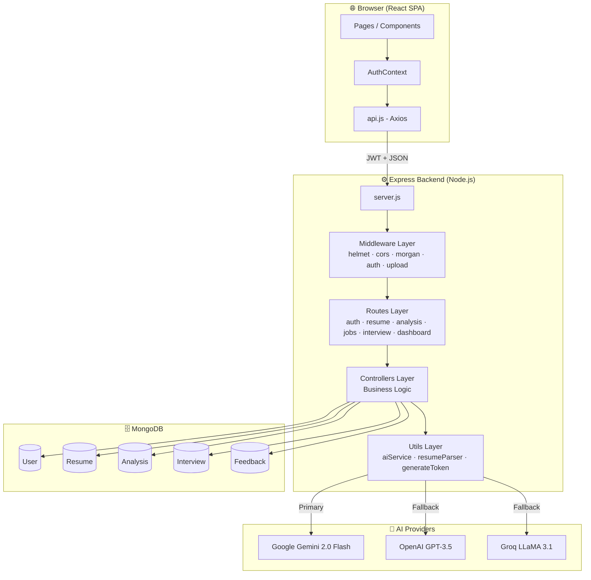
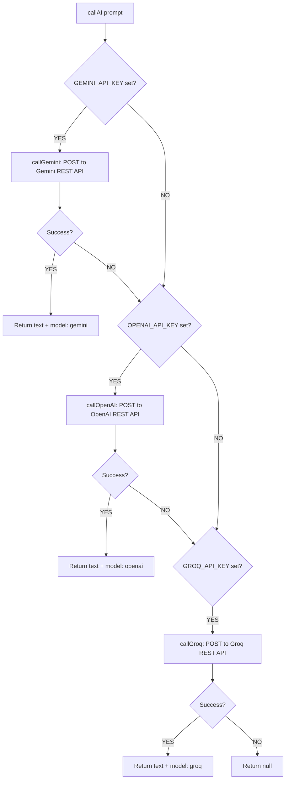

# ARCHITECTURE — ResumeXpert AI

---

## 1. 🏗️ Overall Architecture

ResumeXpert AI follows a modern **3-tier architecture** optimized for real-time AI processing:

```
┌─────────────────────────────────────────────────────────────┐
│                    CLIENT TIER (Browser)                     │
│                React SPA (Vite + Tailwind CSS)               │
│   Pages → Components → Context → Services (Axios calls)      │
└────────────────────────────┬────────────────────────────────┘
                             │ HTTP/JSON REST API
                             │ (JWT Bearer Token)
┌────────────────────────────▼────────────────────────────────┐
│               APPLICATION TIER (Express Server)              │
│         Routes → Middleware → Controllers → Utils            │
│     Node.js on Port 5000 (or PM2 in production)             │
└──────────┬──────────────────────────────┬───────────────────┘
           │ Mongoose ODM                  │ HTTP (node-fetch)
           ▼                              ▼
┌──────────────────┐         ┌───────────────────────────────┐
│   DATA TIER      │         │     AI SERVICES TIER           │
│   MongoDB        │         │  Gemini → OpenAI → Groq        │
│   (Atlas/Local)  │         │  (3-provider fallback chain)   │
└──────────────────┘         └───────────────────────────────┘
```

---

## 2. 🧩 Architecture Diagram (Full System)



---

## 🏛️ Design Patterns Used

### MVC (Model-View-Controller)
The backend maintains a strict MVC separation to ensure maintainability as the Career OS grows.

### Fallback Chain Pattern
Implemented in `aiService.js` to ensure the platform remains functional even if primary AI providers experience outages.

### Context Pattern
Frontend state is managed via React's Context API, primarily for global authentication and user preferences.

---

## 🔐 Authentication & Roles

ResumeXpert AI utilizes stateless JWT authentication to manage access to its premium modules.

### Permission Matrix

| Role | Permissions |
|------|------------|
| **Job Seeker** | Primary role; full access to Career OS modules (Analysis, Builder, Interview, Jobs). |
| **Guest** | Instant demo access with pre-configured sandbox data. |
| **Admin** | System-wide monitoring and platform-level analytics. |

---

## 🤖 AI Fallback Architecture



---

## 📁 File Upload Architecture

Resumes are processed through a multi-stage pipeline:
1. **Multer Middleware:** Handles multi-part data and disk storage.
2. **Parser Service:** Extracts and structures document text via `pdf-parse` or `mammoth`.
3. **Database Layer:** Persists the document and updates the user's intelligence profile.

---

## 📋 Summary

The ResumeXpert AI architecture is built for high-density visual performance and reliable AI intelligence:
- **Resilient AI Core:** 3-provider fallback ensures 24/7 service.
- **Premium UX Foundation:** React + Vite provides the speed required for a "Career OS" feel.
- **Scalable Data Structure:** MongoDB documents allow for flexible storage of complex AI analysis results.

---

*Project: ResumeXpert AI*
*Identity: Analyze. Optimize. Prepare. Get Hired.*
sts to /api/* forwarded to backend
       ↓
  Railway / Render (Backend)
    └─ Node.js + Express (PM2 in fork mode)
    └─ .env set via dashboard
         ↓
  MongoDB Atlas (Cloud DB)
    └─ Managed replica set
         ↓
  AI APIs (External)
    ├─ api.gemini.google.com
    ├─ api.openai.com
    └─ api.groq.com
```

---

## 📋 Summary

The architecture is straightforward and beginner-friendly while being production-ready:
- **Backend**: Node.js + Express MVC with clean separation of routes, controllers, models, and utilities.
- **Frontend**: React SPA with Context API for global auth state and page-level local state for everything else.
- **AI**: Multi-provider fallback chain ensures high availability.
- **Auth**: Stateless JWT — no server-side sessions needed.
- **Database**: MongoDB with Mongoose for schema validation and performance indexes.
- **Design pattern**: MVC + Middleware chain + Service layer — proven and scalable.

---

*Next: See [SETUP_AND_RUN.md](./SETUP_AND_RUN.md) for installation instructions.*
