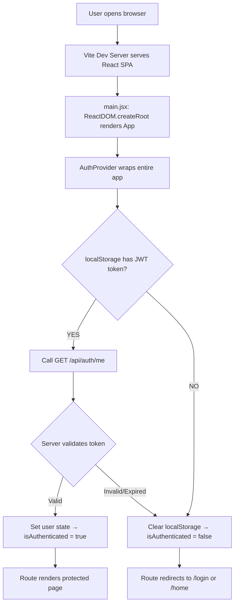
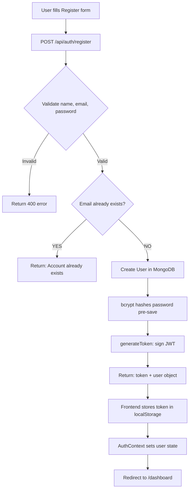
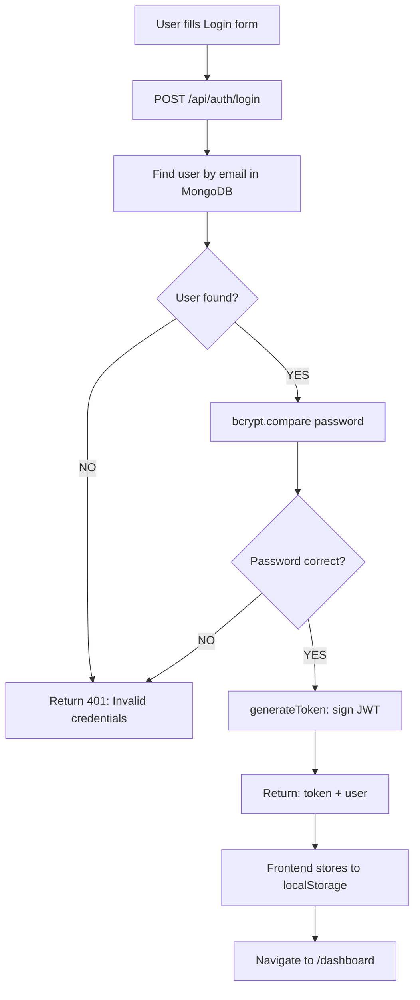
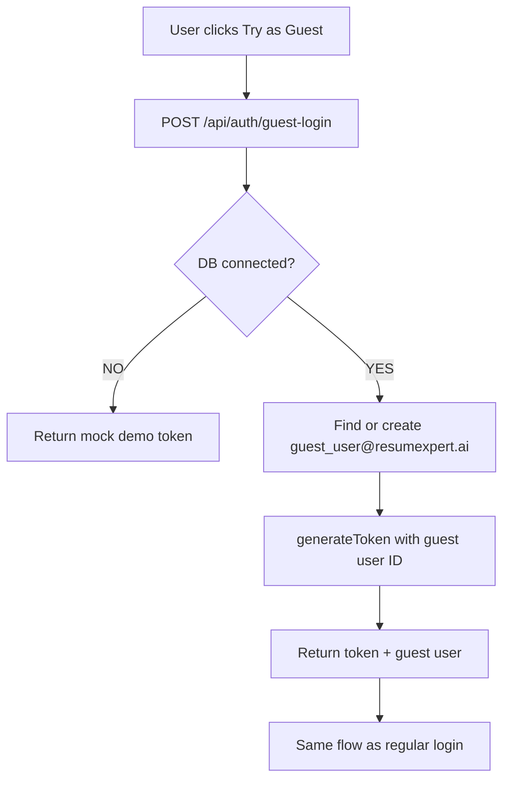
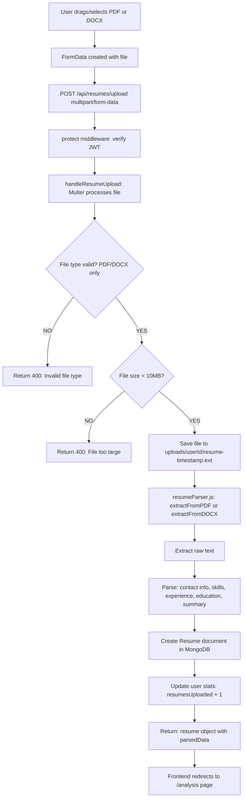
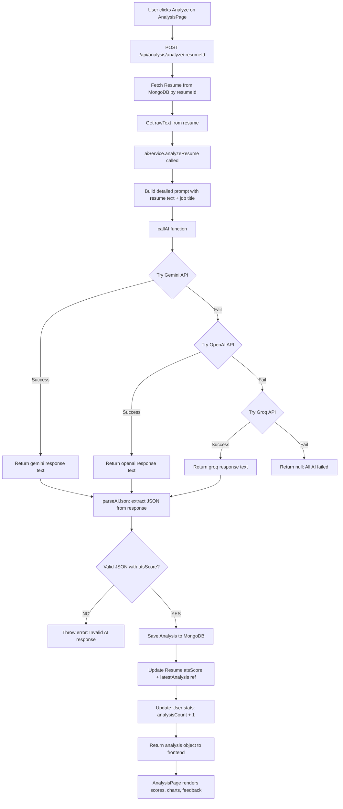
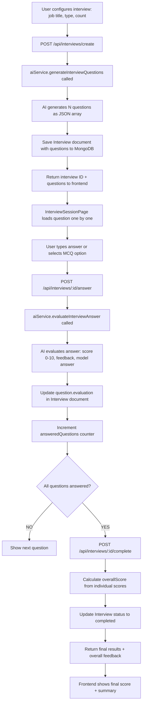
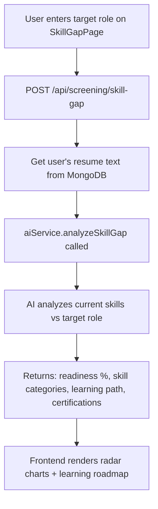
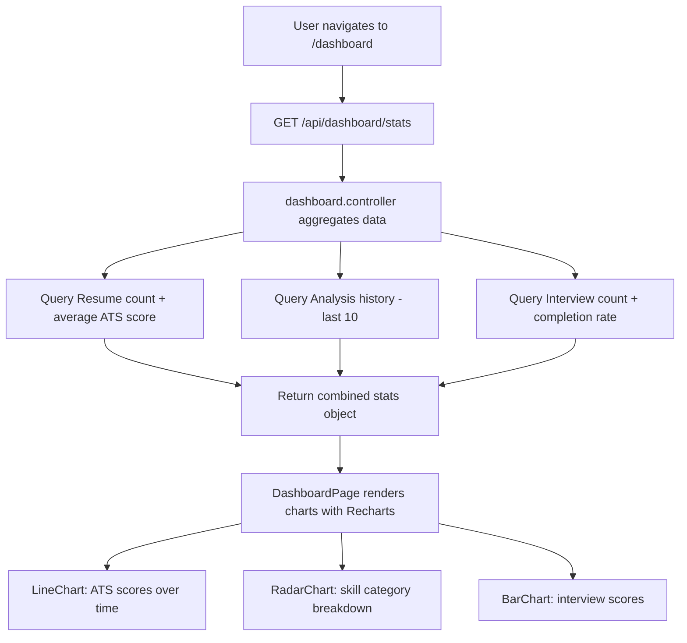

# APPLICATION FLOW — ResumeXpert AI

This document explains the complete application flow from the moment a user opens the app to when they receive AI-powered career insights.

---

## 1. 🚦 Application Startup Flow



---

## 2. 🔐 Authentication Flow

### 2a. Register



### 2b. Login



### 2c. Guest Login



---

## 3. 📤 Resume Upload Flow



---

## 4. 🧠 AI Resume Analysis Flow



---

## 5. 🎤 Interview Coach Flow



---

## 6. 🔍 Skill Gap Analysis Flow



---

## 8. 📊 Dashboard Analytics Flow



---

## 9. 🔒 Request Authentication Flow (Every Protected Route)

```mermaid
flowchart TD
    A[Frontend sends API request] --> B[Axios request interceptor]
    B --> C[Read token from localStorage]
    C --> D[Attach Authorization: Bearer token header]
    D --> E[Request reaches Express route]
    E --> F[protect middleware runs]
    F --> G{Token present in header?}
    G -- NO --> H[Return 401: No token]
    G -- YES --> I[jwt.verify token with JWT_SECRET]
    I --> J{Token valid?}
    J -- Expired --> K[Return 401: Token expired]
    J -- Invalid --> L[Return 401: Invalid token]
    J -- Valid --> M[Find user in MongoDB by decoded.id]
    M --> N{User exists and active?}
    N -- NO --> O[Return 401: User not found]
    N -- YES --> P[Attach req.user = user]
    P --> Q[next() → Controller runs]
```

---

## 10. 📋 Summary

The application follows a clean, predictable request cycle:

1. **Frontend** prepares data and calls `api.js` service functions.
2. **Axios interceptors** auto-attach JWT tokens.
3. **Express routes** receive requests and forward to middleware.
4. **Auth middleware** verifies JWT before any protected logic runs.
5. **Controllers** contain business logic — call models and AI services.
6. **AI Service** uses a 3-provider fallback chain for reliability.
7. **Models** persist and retrieve data from MongoDB.
8. **Error handler** catches any thrown errors and returns consistent JSON.
9. **Frontend** renders the response using React state and charts.

---

*Next: See [ARCHITECTURE.md](./ARCHITECTURE.md) for system architecture and design patterns.*
