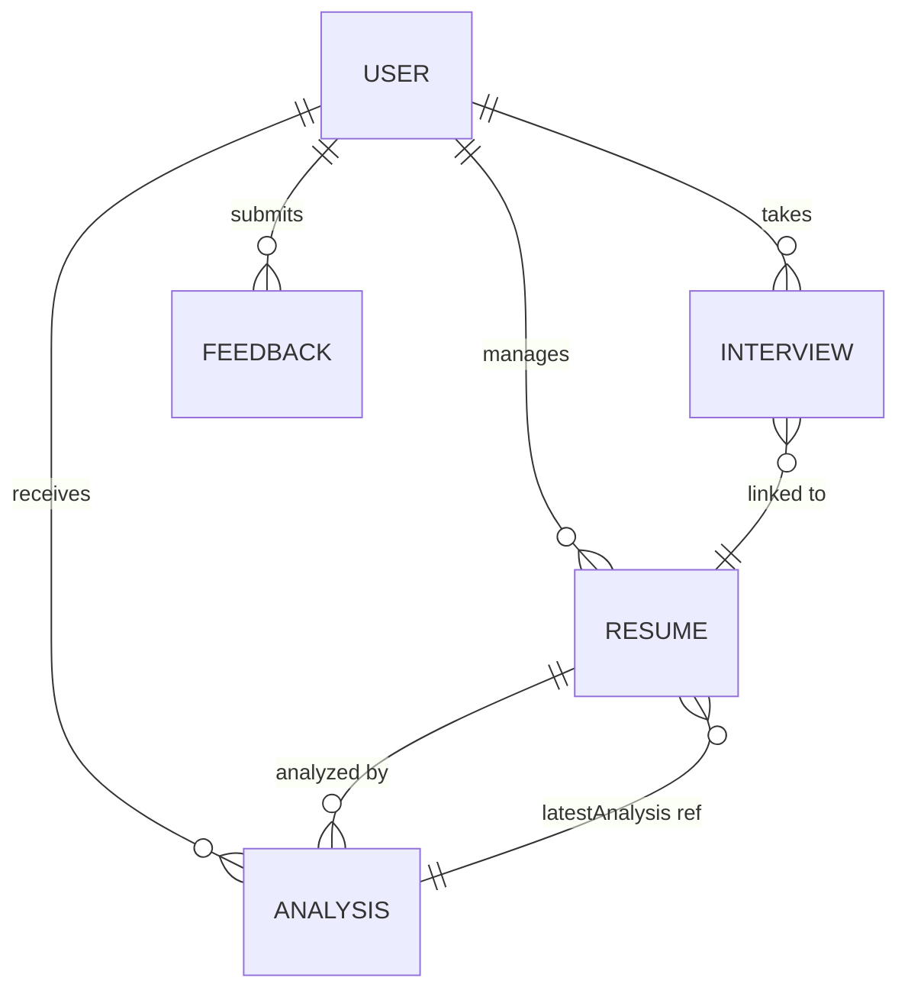

# DATABASE DOCUMENTATION — ResumeXpert AI

This document explains the MongoDB database structure, all collections, their fields, and data flow in the ResumeXpert AI "Career OS".

---

## 📦 Database Configuration

| Detail | Value |
|--------|-------|
| **Database** | MongoDB (NoSQL Document Database) |
| **ODM** | Mongoose v8 |
| **Default DB Name** | `resumexpert-ai` |
| **Connection** | Via `MONGODB_URI` in `.env` |

---

## 🗄️ Collections Overview

| Collection | Purpose |
|-----------|---------|
| `users` | Stores identities, intelligence profiles, and platform growth stats |
| `resumes` | Stores uploaded metadata, OCR-extracted text, and semantic parsing |
| `analyses` | Stores deep AI ATS scores and qualitative feedback |
| `interviews` | Stores AI-led sessions, contextual questions, and evaluations |
| `jobs` | Stores semantically indexed job listings for the matching engine |
| `feedbacks` | Stores platform reviews and development requests |

---

## 👤 Collection: `users`

### Purpose
Stores every registered job seeker and administrator. Handles the core identity and progress tracking.

### Schema Fields

| Field | Type | Description |
|-------|------|-------------|
| `name` | String | User's full name |
| `email` | String | Primary identity and communication channel |
| `password` | String | Securely hashed credential |
| `role` | String | `jobseeker` (default) or `admin` |
| `profile.*` | Object | Social links, target roles, and bio |
| `stats.*` | Object | Real-time counters for resumes, analyses, and scores |
| `isActive` | Boolean | Account status toggle |

---

## 📄 Collection: `resumes`

### Purpose
The semantic foundation of the platform. Stores raw and structured data for every uploaded document.

### Key Fields
- `user`: Reference to the document owner.
- `parsedData`: Object containing AI-extracted skills, experience, and contact info.
- `atsScore`: The most recent simulated ATS ranking.
- `isPrimary`: Flag for the main resume used in job matching.

---

## 📊 Collection: `analyses`

### Purpose
Detailed diagnostic reports generated by the AI engine.

### Key Fields
- `scoreBreakdown`: Quantitative metrics for formatting, keywords, and experience.
- `strengths / weaknesses`: Qualitative AI insights.
- `missingSkills`: Gap identification for target roles.

---

## 🎤 Collection: `interviews`

### Purpose
Tracks the interactive sessions between the user and the 24/7 AI coach.

### Key Fields
- `questions`: Array of contextual, resume-based prompts.
- `evaluations`: Per-answer feedback and score.
- `overallScore`: Holistic readiness metric.

---

## 💼 Collection: `jobs`

### Purpose
Indexed repository of roles used by the semantic Job Matcher.

---

## 🔗 Entity Relationship Diagram

---

## 📋 Summary

The ResumeXpert AI database is optimized for semantic retrieval and high-density analytics. With 6 core collections, the schema allows for complex relationships between user growth data and AI-generated intelligence, ensuring a robust foundation for the "Career OS" ecosystem.

---

*Project: ResumeXpert AI*
*Stack: MERN + Gemini + OpenAI + Groq*

*Next: See [COMPONENTS_OR_MODULES.md](./COMPONENTS_OR_MODULES.md) for frontend components and backend modules.*
