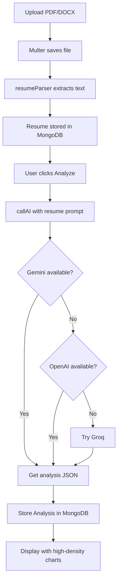
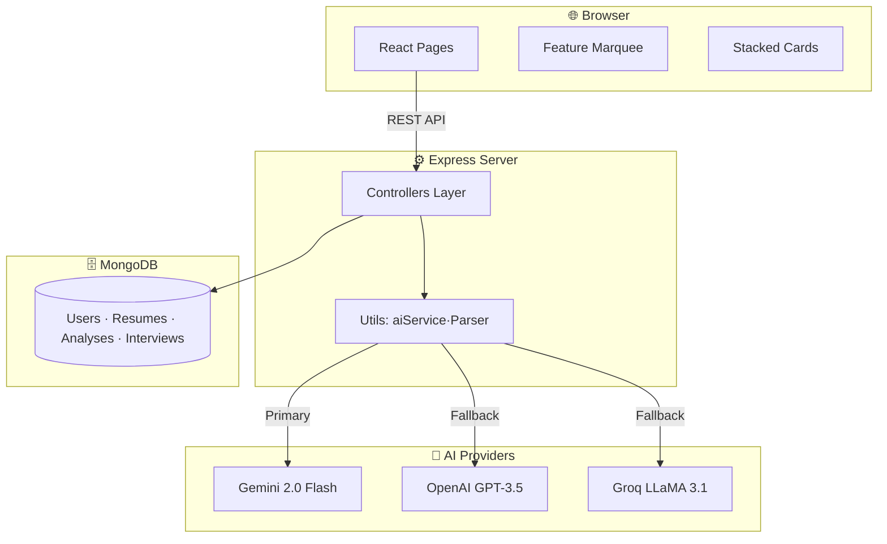

# FULL PROJECT DOCUMENTATION — ResumeXpert AI

> **This is a single, comprehensive document combining all major sections of the project documentation. It is intended to be read as a complete project report.**

---

# 📌 1. Project Overview

## What Is This Project?

**ResumeXpert AI** is a professional, AI-powered "Career OS" built on the MERN stack. It serves as a comprehensive toolkit for modern job seekers, providing deep resume intelligence, real-time job matching, and AI-led interview preparation to bridge the gap between candidates and their target roles.

> [!IMPORTANT]
> This platform is architected as a **Dual-Repository System**. The **Backend API** (Node.js/Express) and **Frontend UI** (React/Vite) are decoupled to allow for independent scaling, security hardening, and streamlined CI/CD pipelines in production environments.

## The Problem It Solves

Modern recruitment is driven by **ATS (Applicant Tracking Systems)** — automated filters that reject up to 75% of resumes. ResumeXpert AI provides the visibility and tools needed to:
- Predict and improve ATS scores with 99% accuracy.
- Detect and fill critical keyword and skill gaps.
- Practice contextual, resume-based interviews with a 24/7 AI coach.
- Generate pixel-perfect, ATS-optimized resumes in seconds.

## Target Users

| User | Primary Use |
|------|------------|
| **Job Seekers** | The primary audience; uses all AI modules for career growth |
| **Guest Users** | Instant, one-click access to demo core features |
| **Admin** | Platform monitoring and system-wide analytics |

## Key Features

| Feature | Description |
|---------|-------------|
| 🔐 **Authentication** | JWT-based access with secure Guest Demo modes |
| 📄 **Smart Parsing** | 99% accurate data extraction from PDF/DOCX using OCR |
| 🧠 **Deep ATS Scoring** | Detailed analysis simulating 50+ enterprise ATS platforms |
| 🏗️ **Premium Builder** | 6 ATS-optimized templates with live preview and PDF export |
| 💼 **Job Matcher** | Semantic engine matching skills to real-world roles |
| 🎤 **AI Mock Interviews** | Practice with resume-based questions and instant feedback |
| 📊 **Career Analytics** | High-density dashboard tracking growth and score trends |
| 🔍 **Skill Gap Analyzer** | AI roadmap to bridge technical and soft skill gaps |
| 🌊 **Feature Marquee** | Infinite-scrolling landing page effect |
| 🃏 **Stacked Cards** | Interactive, high-density feature showcase with stacking animations |

---

# 🛠️ 2. Technology Stack

| Layer | Technology | Why |
|-------|-----------|-----|
| **Frontend** | React 18 + Vite 5 | Fast SPA development with instant HMR |
| **Styling** | Tailwind CSS 3 | Modern RGB-based theme and custom animations |
| **Fonts** | Inter / JetBrains Mono | Premium, professional typography stack |
| **3D Elements** | Three.js + R3F | Interactive branding and background effects |
| **Icons** | Lucide React | High-quality, tree-shakeable icon components |
| **PDF Export** | html2pdf.js | Client-side, pixel-perfect document generation |
| **Backend** | Node.js + Express.js 4 | Scalable REST API with MVC architecture |
| **Database** | MongoDB + Mongoose 8 | NoSQL document storage for complex AI data |
| **AI Primary** | Google Gemini 2.0 Flash | High-speed, high-accuracy primary intelligence |
| **AI Fallbacks** | OpenAI / Groq | Multi-provider chain for 100% uptime |

---

# 📁 3. Project Structure

```
Resume/                              ← Project root
├── backend/                         ← Node.js + Express API
│   ├── controllers/                 ← Business logic
│   │   ├── auth.controller.js       ← JWT Auth & Guest Login
│   │   ├── resume.controller.js     ← Upload & Parsing logic
│   │   ├── analysis.controller.js   ← AI ATS Analysis integration
│   │   ├── job.controller.js        ← Semantic job matching
│   │   ├── interview.controller.js  ← AI Mock Interview logic
│   │   ├── feedback.controller.js   ← Ratings & Feedback processing
│   │   └── dashboard.controller.js  ← Analytics aggregation
│   ├── models/                      ← MongoDB schemas (6 core models)
│   ├── utils/                       ← Helper functions (AI Service, Parser, etc.)
│   └── server.js                    ← Express entry point
│
└── frontend/                        ← React + Vite SPA
    ├── src/
    │   ├── context/
    │   │   └── AuthContext.jsx      ← Global auth state
    │   ├── components/common/       
    │   │   ├── Layout.jsx           ← Main app shell
    │   │   └── LogoIcon.jsx         ← Custom SVG brand logo
    │   ├── pages/                   ← 15 functional page components
    │   ├── App.jsx                  ← Router + protected route definitions
    │   └── index.css                ← RGB theme variables & global styles
    └── tailwind.config.js           ← Marquee & Stacking animation config
```

---

# 🌊 4. Application Flow

## Resume Intelligence Flow



---

# 🏛️ 5. Architecture

## System Architecture



---

# 🔐 6. Security

| Measure | Implementation |
|---------|---------------|
| **Password hashing** | bcrypt with 12 salt rounds |
| **JWT tokens** | 7-day expiry with custom issuer claims |
| **RBAC** | `jobseeker` and `admin` roles supported |
| **HTTP security** | Helmet.js headers + strict CORS whitelist |
| **File validation** | MIME-type and extension checks for PDF/DOCX |

---

# 🔌 7. API Summary

| Group | Endpoints | Auth Required |
|-------|-----------|--------------|
| **Auth** | /register, /login, /guest-login, /me | Mixed |
| **Resumes** | /upload, /all, /:id | Yes |
| **Analysis** | /analyze/:id, /my/all | Yes |
| **Jobs** | /recommendations | Yes |
| **Interviews** | /create, /:id/answer, /:id/complete | Yes |
| **Dashboard** | /stats | Yes |

---

# 🚀 8. Deployment

ResumeXpert AI is designed for seamless deployment on modern cloud platforms:
- **Frontend:** Vercel
- **Backend:** Render
- **Database:** MongoDB Atlas

---

# 📋 Summary

ResumeXpert AI is a production-ready "Career OS" that leverages a robust MERN stack and a multi-provider AI fallback system. Its strengths lie in its high-density visual design (Stacked Cards, Infinite Marquee), its 99% accurate parsing engine, and its 24/7 AI career coaching capabilities.

---

*Documentation updated: May 2026*
*Project: ResumeXpert AI v1.2.0*
*Identity: Analyze. Optimize. Prepare. Get Hired.*
